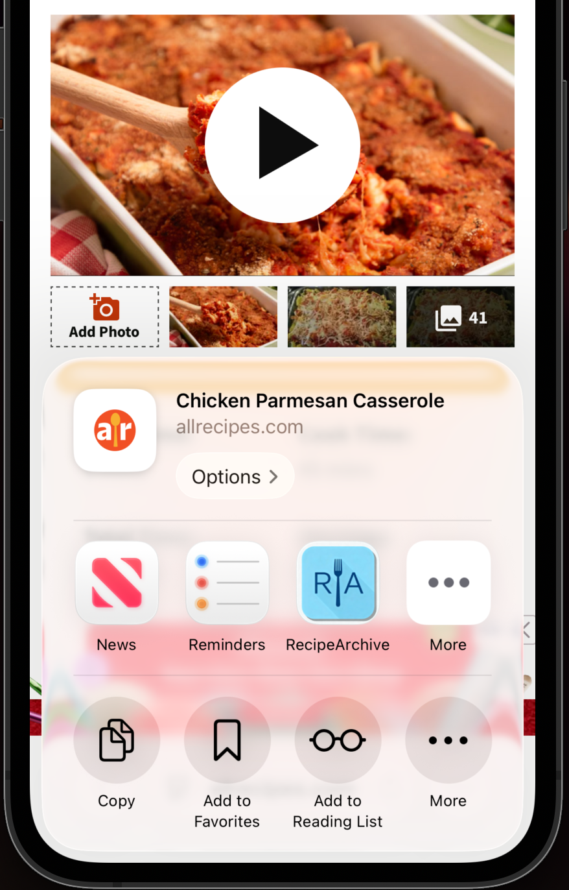

# RecipeArchive

Personal recipe management with browser extensions, native mobile apps, and AWS serverless backend.

[](https://github.com/bordenet/RecipeArchive/actions/workflows/pre-commit-quality-gates.yml)
[](https://github.com/bordenet/RecipeArchive/actions/workflows/parser-health-check.yml)
[](https://codecov.io/gh/bordenet/RecipeArchive)

<table style="width:100%; border-collapse: collapse;">
  <!-- Top row: Gallery image -->
  <tr>
    <td colspan="2" style="text-align: center;">
      
      <div style="margin-top: 4px; font-size: 0.9em;">
        <b>Web Application Gallery View</b>
      </div>
    </td>
  </tr>

  <!-- Second row: Desktop Details + Web Extension side-by-side -->
  <tr>
    <td style="text-align: left; vertical-align: top;">
      
      <div style="font-size: 0.9em;">Desktop Details View</div>
    </td>
    <td>
      <table style="width:100%; border-collapse: collapse;">
      <tr>
        <td style="text-align: left; vertical-align: top;">
          
          <div style="font-size: 0.9em;">Web Extension</div>
        </td>
      </tr>
      <tr>
        <td style="text-align: left; vertical-align: top; padding-top: 64px;">
          
          <div style="font-size: 0.9em;">iOS Native Sharing</div>
        </td>
      </tr>
      </table>
    </td>
  </tr>
</table>


## Quick Links

- **[Getting Started Guide →](docs/setup/GETTING_STARTED.md)** - Complete setup and deployment
- **[Command Reference →](COMMANDS.md)** - Quick lookup for all commands
- **[Development Guide →](CONTRIBUTING.md)** - Conventions and best practices

## Supported Recipe Sites (15)

| Supported Sites |  |  |
|-----------------|--|--|
| [Smitten Kitchen](https://smittenkitchen.com) | [Food Network](https://foodnetwork.com) | [NYT Cooking](https://cooking.nytimes.com) |
| [Food52](https://food52.com) | [AllRecipes](https://allrecipes.com) | [Epicurious](https://epicurious.com) |
| [Serious Eats](https://seriouseats.com) | [Love & Lemons](https://loveandlemons.com) | [Washington Post](https://washingtonpost.com) |
| [Food & Wine](https://foodandwine.com) | [Damn Delicious](https://damndelicious.net) | [Alexandra's Kitchen](https://alexandracooks.com) |
| [Lemons and Zest](https://lemonsandzest.com) | [The Anthony Kitchen](https://theanthonykitchen.com) | [Laura in the Kitchen](https://laurainthekitchen.com) |


<details>
  <summary>Mobile Features</summary>

- **iOS Share Extension** — Share recipes directly from Safari to the iOS app
- **Screen Wakelock** — Screen stays on during cooking (30-40+ minutes)
- **Device Targeting** — iPhone 16e, iPad on Mac, iPhone 17 Pro Max with fallbacks
- **iOS/Android Toolchains** — Xcode integration, simulator management, APK builds
- **Full-text Search** — Same search on mobile as web
- **Self-hosted** — Native apps and browser extensions built from this repo, not from app stores

### iOS Share Extension in Action


**Native iOS Integration**: Share recipes from Safari mobile directly to the RecipeArchive app. The backend fetches and parses the recipe HTML, extracts ingredients and instructions, downloads and stores the recipe image in S3, and normalizes the content with OpenAI. Android behaves similarly.

**How it works:**
1. Browse recipe in a web browser of your choice on iPhone/iPad or Android
2. Tap the platform-native Share button → Select "RecipeArchive"
3. App opens and processes the URL automatically
4. Recipe appears in your collection with full content and images

No manual copying or desktop workflow required.
</details>
<details>
  <summary>Screenshots -- Native Apps</summary>
  These screenshots were taken from XCode and Android Studio emulators. The mobile website looks identical in these form factors.
<table style="width:100%; margin-top: 4px; margin-bottom: 4px; border: 0;">
  <tr style="border: 0;">
    <td style="text-align: center;">
        
    </td>
    <td style="text-align: center;">
        
    </td>
    <td style="text-align: center;">
        
    </td>
    <td style="text-align: center;">
        
    </td>
    <td style="text-align: center;">
        
    </td>
    <td style="text-align: center;">
        
    </td>
    <td colspan="2" style="text-align: center;">
      
    </td>
  </tr>
  <tr style="border: 0;">
    <td colspan="3" style="text-align: center;">
      
    </td>
    <td colspan="4" style="text-align: center;">
      
    </td>
  </tr>
</table>
</details>
<details>
  <summary>Platform Support</summary>

- **Web App**: Flutter web app with responsive design and mobile optimization
- **iOS Apps**: Complete development toolchain with device targeting (iPhone 16e, iPad on Mac, iPhone 17 Pro Max)
- **Android Apps**: Full development environment with emulator management and APK builds
- **Mobile Features**: Screen wakelock for hands-free cooking, optimized mobile UX
- **Browser Extensions**: Chrome and Safari extensions with intelligent parsing for 14+ recipe sites
- **Cloud Backend**: AWS Lambda functions with real-time sync and multi-tenant architecture
</details>

## Key Features

### Capture

Chrome/Safari extensions, iOS Share Extension, Android Share Intent (planned), direct URL import

### Processing

OpenAI normalization, ingredient/instruction extraction, metadata enrichment, image storage

### Cooking UX

Yield scaling (2x, ½x), unit conversion, screen wakelock, distraction-free view

### Multi-tenant

Invitations, shared collections, per-tenant Cognito auth, encrypted S3 storage

## Quick Start

**Complete setup guide:** [docs/setup/GETTING_STARTED.md](docs/setup/GETTING_STARTED.md)

```bash
# 1. Clone and install
git clone https://github.com/bordenet/RecipeArchive
cd RecipeArchive && npm install

# 2. Deploy AWS infrastructure
./scripts/aws/deploy-infrastructure.sh

# 3. Deploy web application
./scripts/web/deploy.sh

# 4. Validate installation
./validate-monorepo.sh --all
```

**Prerequisites:** macOS, AWS account, OpenAI API key

**Estimated Cost:** $4-7/month for personal use (AWS Free Tier available)

## Development

### Testing & Quality

```bash
# Unit Tests
npm run test:unit                 # Run unit tests
npm run test:parsers              # Run parser tests
npm run test:coverage             # Generate coverage report

# Integration Tests (require network/browser)
npm run test:integration          # Integration tests
npm run test:e2e                  # End-to-end parser tests

# Go Tests
npm run test:go                   # Go backend tests
cd aws-backend/functions/local-server && go test -cover -v

# Validation
./validate-monorepo.sh --all      # Full test suite (17 modules)
./validate-monorepo.sh --p1       # Quick validation (~30s)
./validate-monorepo.sh --mobile   # Mobile-only validation
```

### Common Commands

```bash
# Deployment
./scripts/web/deploy.sh           # Deploy web app
./scripts/aws/lambda.sh --all     # Deploy all Lambda functions (10 functions)

# Mobile Development
./scripts/ios/build.sh --dev --run              # iOS development build
./scripts/android/build.sh --dev --run          # Android development build
./scripts/ios/build.sh --prod --release --version 1.0.1    # iOS production
```

### Lambda Deployment Notes

The deployment script skips three development tools that are not deployed to AWS:
- `local-server` - Local development HTTP server for testing
- `s3-manager` - CLI utility for S3 operations
- `test-tools` - Testing and validation utilities

These warnings are expected and can be safely ignored. All 10 Lambda functions deploy successfully.

**Complete command reference:** [COMMANDS.md](COMMANDS.md)

### Documentation

| Category | Document | Purpose |
|----------|----------|---------|
| **Setup** | [Getting Started](docs/setup/GETTING_STARTED.md) | 15-minute production deployment |
| **Development** | [Contributing Guide](CONTRIBUTING.md) | Conventions and best practices |
| **Reference** | [Command Reference](COMMANDS.md) | Quick command lookup |
| **Testing** | [E2E Parser Testing](docs/testing/e2e-parser-testing.md) | Automated parser validation |
| **API** | [API Specification](docs/api/api-specification.md) | Backend API reference |
| **Mobile** | [Mobile Deployment](recipe_archive/MOBILE_DEPLOYMENT.md) | iOS/Android builds |
| **Extensions** | [Browser Extensions](extensions/README.md) | Chrome/Safari development |

### Architecture

**Tech Stack:** Go (Lambda), Flutter (web/mobile), TypeScript (extensions), AWS (S3, Cognito, API Gateway)

---

## Code Coverage

[](https://codecov.io/gh/bordenet/RecipeArchive)

Green = >80%, Yellow = 60-80%, Red = <60%. Click for line-by-line details.
