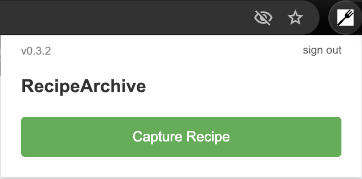
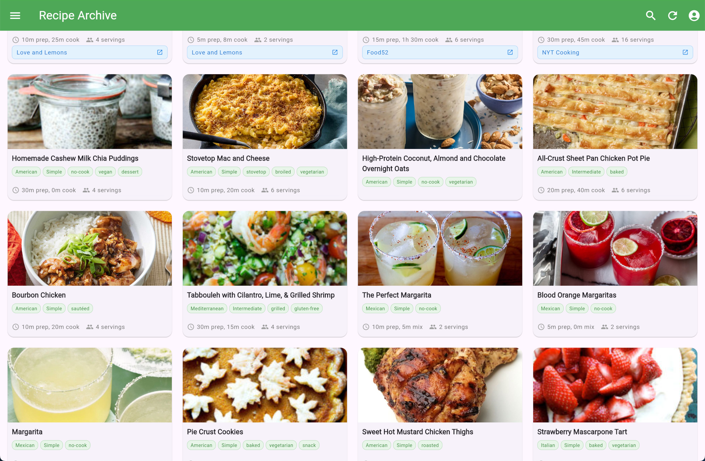

# RecipeArchive

**A comprehensive recipe archiving platform for home cooks**






> **AI Collaboration Note**: This project has been a fun opportunity to experiment with collaboration between Claude Code and Google Gemini. As such, there are Gemini artifacts in parts of the repo (primarily tools development). Unfortunately, Gemini's track record has been poor compared to Claude's reliability, so Gemini is relegated to secondary tooling tasks.

Capture, organize, and access your favorite recipes from 13+ supported website with intelligent parsing, cross-device synchronization, and a modern web interface. Features OpenAI-powered recipe normalization with automatic time estimates and serving calculations, plus multi-tenant user provisioning for controlled expansion.

## Supported Recipe Sites

**Currently Supported (13 sites):**

- Smitten Kitchen, Food Network, NYT Cooking, Food52
- AllRecipes, Epicurious, Serious Eats, Love & Lemons
- Washington Post, Food & Wine, Damn Delicious, Alexandra's Kitchen

All sites have comprehensive JSON-LD and HTML parsing with full test coverage.

## 🚀 Quick Start

### Automatic Setup (macOS)

```bash
# Clone the repository
git clone https://github.com/bordenet/RecipeArchive
cd RecipeArchive

# Run the automated setup script (installs all dependencies)
./scripts/setup-macos.sh

# Set up environment variables
cp .env.example .env
# Edit .env with your AWS credentials (see AWS Setup section below)

# Validate setup using the wrapper script (recommended for new users)
./validate-monorepo.sh --all
```

### Manual Setup (All Platforms)

If you prefer manual setup or aren't on macOS, install these dependencies:

**Required:**

- [Node.js 18+](https://nodejs.org/) - JavaScript runtime
- [Go 1.19+](https://golang.org/) - Backend services
- [Flutter 3.10+](https://flutter.dev/) - Web app development
- [AWS CLI](https://aws.amazon.com/cli/) - Cloud deployment

**Optional but recommended:**

- [Git](https://git-scm.com/) - Version control
- [Visual Studio Code](https://code.visualstudio.com/) - IDE

After installing dependencies:

```bash
# Install project dependencies
npm install

# Build TypeScript parsers
npm run build:parser-bundle

# Validate setup using the wrapper script (recommended)
./validate-monorepo.sh --all
```

## AWS Setup

RecipeArchive uses AWS for backend services. You'll need:

1. **AWS Account** - [Create one here](https://aws.amazon.com/) (free tier eligible)
2. **Configure AWS CLI:**
   ```bash
   aws configure
   # Enter your Access Key ID, Secret Key, and region (us-west-2)
   ```
3. **Edit `.env` file** with your AWS details:
   ```bash
   cp .env.example .env
   # Edit .env with your actual AWS credentials
   ```

**Expected AWS costs:** ~$1-5/month during development

## Architecture

- **Extensions:** Chrome/Safari with TypeScript parsers + AWS Cognito auth
- **Parsers:** Registry system for 13+ recipe sites with JSON-LD + HTML extraction
- **Content Normalization:** OpenAI GPT-4o-mini integration for recipe enhancement at ingestion
  - Title standardization, ingredient normalization, instruction clarity
  - Metadata inference (cuisine type, cooking methods, dietary info, difficulty)
  - Graceful fallback when OpenAI unavailable
- **Backend:** Go serverless functions (AWS Lambda) + S3 storage + Cognito auth
- **Frontend:** Flutter web app with responsive design + CloudFront deployment

## Development Workflow

```bash
# Full monorepo validation (recommended before commits)
go run tools/monorepo-validator --med

# Individual component testing
npm run lint           # Code quality checks
npm run test:parsers   # Parser functionality
npm run test:go        # Backend services

# Build and deploy
npm run build:parser-bundle  # Compile parsers
cd aws-backend && cdk deploy # Deploy infrastructure
```

## Documentation

### Setup Guides

- [Flutter Web Deployment](docs/flutter-web-deployment.md) - Step-by-step deployment guide
- [AWS Setup Guide](docs/setup/aws-setup.md) - Detailed AWS configuration
- [Environment Setup](docs/setup/ENVIRONMENT_SETUP.md) - Environment variable configuration
- [macOS Setup Script](scripts/setup-macos.sh) - Automated development environment setup

### Development Environment

**AI-Powered Development with MCP Servers:**

- **Claude Desktop**: 6 MCP servers (GitHub, ESLint, Flutter, Jest, Browser, NPM)
- **Claude Code**: 4 MCP servers (GitHub, Filesystem, ESLint, Flutter)
- **Cross-platform workflow**: Repository management, code quality, testing automation
- **Setup**: Run `./scripts/setup-macos.sh` for complete automated configuration

### Development

- [CLAUDE.md](CLAUDE.md) - Current project status and priorities
- [API Documentation](docs/api/api-specification.md) - Backend API specification
- [Test Coverage](docs/VERSIONING.md) - Version management and testing strategy

## Security

- **No hardcoded secrets** - All credentials via environment variables
- **TruffleHog scanning** - Automated secret detection in CI/CD
- **Multi-tenant isolation** - Complete user data separation with JWT validation
- **AWS best practices** - IAM roles, VPC, encryption at rest

## Current Status

### Features

- ✅ Chrome & Safari extensions with 13-site parser support and authentication
- ✅ AWS serverless backend with S3 storage and multi-tenant architecture
- ✅ Flutter web app with responsive design, pagination, and admin tools
- ✅ OpenAI-powered recipe normalization with automatic time estimates
- ✅ Invitation-only user provisioning system with quota management
- ✅ Comprehensive automated test suite (32 extension tests + build validation)
- ✅ Star rating system with per-user personal ratings (whole numbers only)
- ✅ Recipe deduplication system prevents duplicate URL submissions
- ✅ Complete end-to-end pipeline: Web extension → AWS processing → Flutter display

### Next Phase Development

- Web extension recipe detection enhancement (prevent empty submissions)
- Content operations tooling for multi-tenant management
- Extension store enrollment (Chrome Web Store, Safari Extensions)
- Android, iOS native apps

---

## Tech Stack

**Backend:** Go (AWS Lambda), TypeScript (AWS CDK), AWS Cognito + S3 + DynamoDB  
**Frontend:** Flutter/Dart (web), JavaScript (browser extensions)  
**Testing:** Jest, Go testing, Flutter widget tests, integration tests, security scanning  
**Infrastructure:** AWS CDK, CloudFront, API Gateway, SES for email delivery

---

_Transform your recipe collection with intelligent capture, organization, and cross-device access_

Have a look through [my other work](https://github.com/bordenet).
