# RecipeArchive v1.0.0

**Save, normalize, search, and cook recipes—with instant links back to the original sources.** Simple browser extensions capture recipes. OpenAI-powered back-end does the heavy lifting of normalization. Dead simple UX makes it easy to scale yields, convert between metric and imperial units, and bypass the life stories and ad bombardment when it's time to cook.

<table style="width:100%; border-collapse: collapse;">
  <!-- Top row: Gallery image -->
  <tr>
    <td colspan="2" style="text-align: center;">
      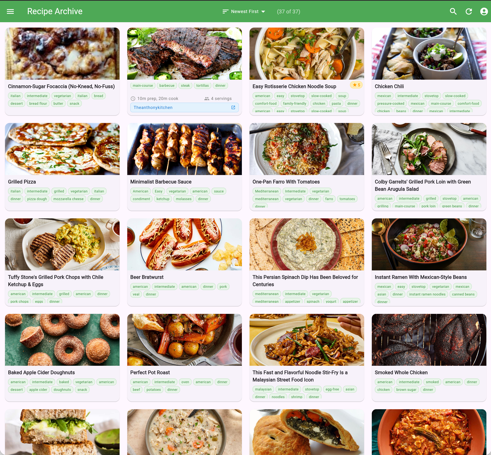
      <div style="margin-top: 4px; font-size: 0.9em;">
        <a href="https://d1jcaphz4458q7.cloudfront.net"><b>Production Website Sample</b></a>
      </div>
    </td>
  </tr>

  <!-- Second row: Desktop Details + Web Extension side-by-side -->
  <tr>
    <td style="text-align: left; vertical-align: top;">
      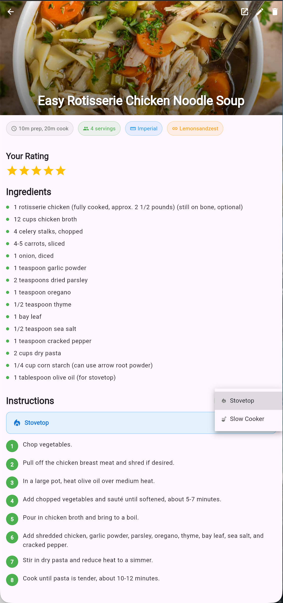
      <div style="font-size: 0.9em;">Desktop Details View</div>
    </td>
    <td style="text-align: left; vertical-align: top;">
      
      <div style="font-size: 0.9em;">Web Extension</div>
    </td>
  </tr>
</table>


**Production-ready cross-platform recipe management solution** - Complete system ready for new adopters to clone and deploy. Capture and organize recipes from 14+ supported websites with browser extensions, Flutter web/mobile apps, and cost-optimized AWS backend infrastructure.

| Supported Sites |  |  |
|-----------------|--|--|
| [Smitten Kitchen](https://smittenkitchen.com) | [Food Network](https://foodnetwork.com) | [NYT Cooking](https://cooking.nytimes.com) |
| [Food52](https://food52.com) | [AllRecipes](https://allrecipes.com) | [Epicurious](https://epicurious.com) |
| [Serious Eats](https://seriouseats.com) | [Love & Lemons](https://loveandlemons.com) | [Washington Post](https://washingtonpost.com) |
| [Food & Wine](https://foodandwine.com) | [Damn Delicious](https://damndelicious.net) | [Alexandra's Kitchen](https://alexandracooks.com) |
| [Lemons and Zest](https://lemonsandzest.com) | [The Anthony Kitchen](https://theanthonykitchen.com) |  |


<details>
  <summary>Mobile Features</summary>

- **🔒 Screen Wakelock**: Screen stays awake during recipe viewing (30-40+ minutes for hands-free cooking)
- **🎯 Device Targeting**: iOS setup supports iPhone 16e, iPad on Mac, iPhone 17 Pro Max with automated fallbacks
- **🍎 iOS Development**: Complete toolchain with Xcode integration and simulator management
- **🤖 Android Development**: Full emulator management and APK build system
- **🔍 Search**: Full-text search across all saved recipes with feature parity to web client
- **📱 Mobile-Optimized UX**: Extensions page guides mobile users to desktop browser workflow
</details>
<details>
  <summary>Screenshots -- Native Apps</summary>
  These screenshots were taken from XCode and Android Studio emulators. The mobile website looks identical in these form factors.
<table style="width:100%; margin-top: 4px; margin-bottom: 4px; border: 0;">
  <tr style="border: 0;">
    <td style="text-align: center;">
        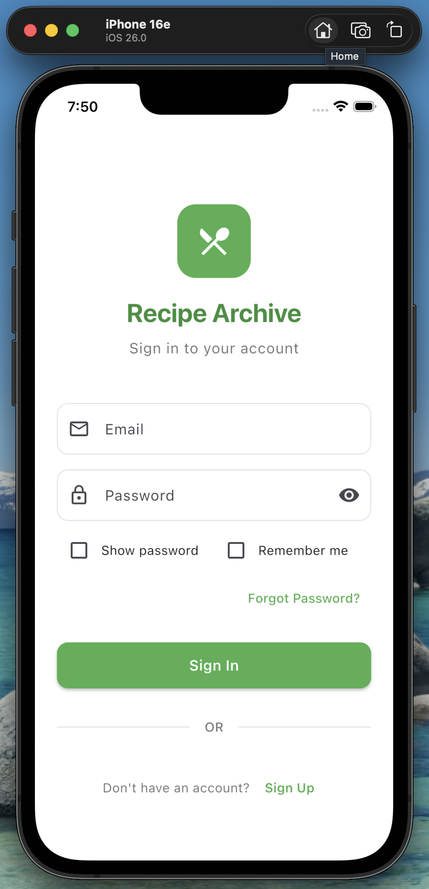
    </td>
    <td style="text-align: center;">
        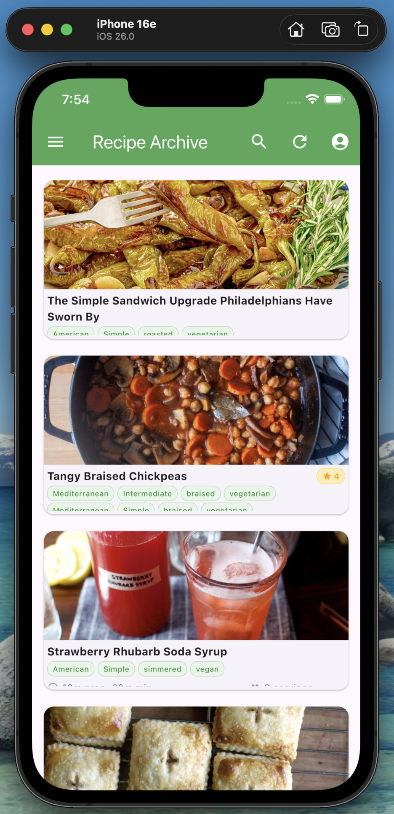
    </td>
    <td style="text-align: center;">
        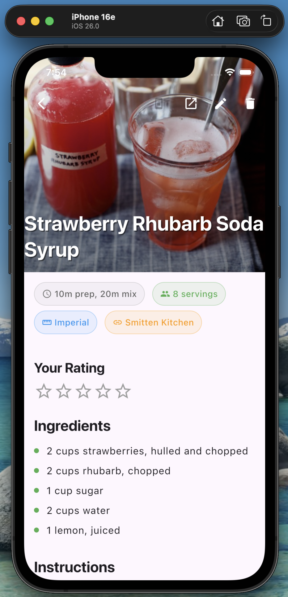
    </td>
    <td style="text-align: center;">
        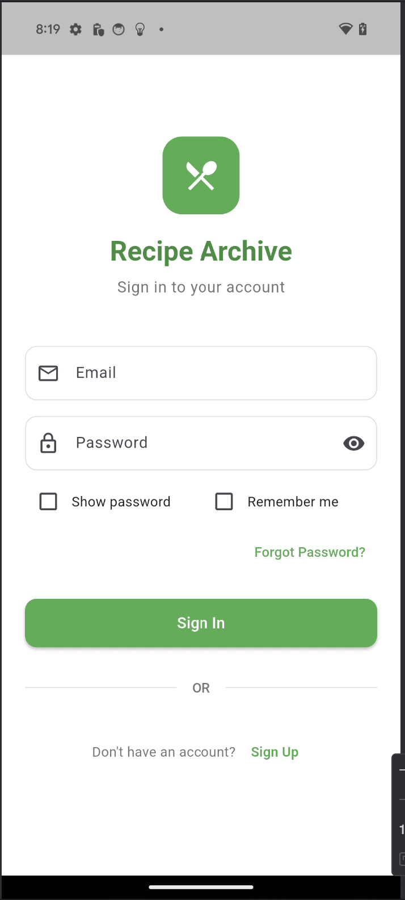
    </td>
    <td style="text-align: center;">
        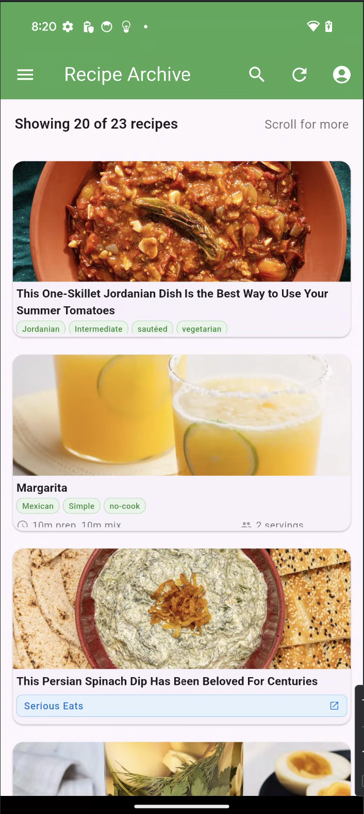
    </td>
    <td style="text-align: center;">
        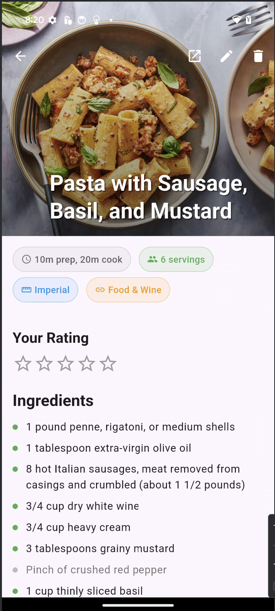
    </td>
    <td colspan="2" style="text-align: center;">
      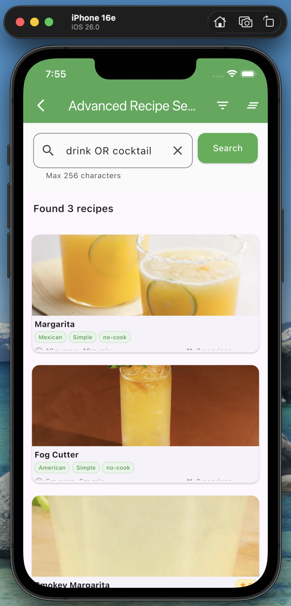
    </td>
  </tr>
  <tr style="border: 0;">
    <td colspan="3" style="text-align: center;">
      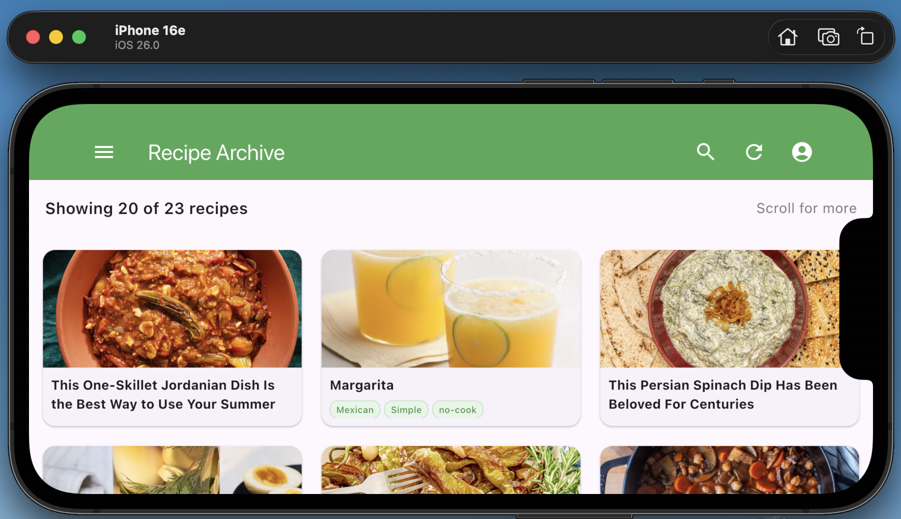
    </td>
    <td colspan="4" style="text-align: center;">
      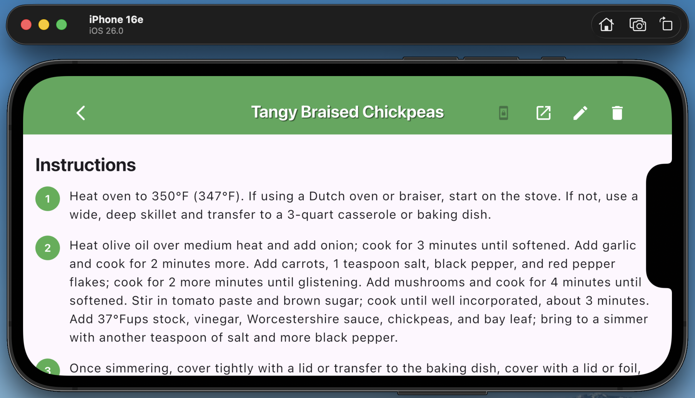
    </td>
  </tr>
</table>
</details>
<details>
  <summary>Platform Support</summary>

- **🌐 Web App**: Flutter web app with responsive design and mobile optimization
- **📱 iOS Apps**: Complete development toolchain with device targeting (iPhone 16e, iPad on Mac, iPhone 17 Pro Max)
- **🤖 Android Apps**: Full development environment with emulator management and APK builds
- **🔒 Mobile Features**: Screen wakelock for hands-free cooking, optimized mobile UX
- **🔌 Browser Extensions**: Chrome and Safari extensions with intelligent parsing for 14+ recipe sites
- **☁️ Cloud Backend**: AWS Lambda functions with real-time sync and multi-tenant architecture
</details>

## 🚀 Quick Start

### Initial Setup (Required for all development)

**⚠️ IMPORTANT**: This project requires setting up YOUR OWN AWS infrastructure. The browser extensions contain hardcoded references to the original developer's AWS resources for distribution purposes, but new adopters must configure their own infrastructure.

```bash
git clone https://github.com/bordenet/RecipeArchive
cd RecipeArchive

# Install dependencies
npm install

# Configure environment variables with YOUR AWS infrastructure
cp .env.example .env
# Edit .env with your AWS credentials and infrastructure details

# CRITICAL: Configure extensions to use YOUR AWS resources
./scripts/setup-new-adopter-environment.sh
```

**CRITICAL STEPS**:

1. **Deploy AWS Infrastructure**: Follow `docs/setup/aws-setup.md` to deploy your own AWS resources first
2. **Configure .env**: Edit `.env` with your AWS infrastructure details (NOT the example values)
3. **Run Setup Script**: `./scripts/setup-new-adopter-environment.sh` updates all browser extensions to use YOUR AWS resources instead of the original developer's

### Development Environment Setup

Once your AWS infrastructure is configured and `.env` is populated, set up your development environment:

```bash
# Install all development dependencies and build tools
./scripts/setup-macos.sh

# Validate everything is working (builds all components automatically)
./validate-monorepo.sh --all
```

**What this does:**
- Installs Node.js, Go, Flutter, AWS CLI, and other dependencies
- Builds all Lambda functions and Go binaries
- Compiles TypeScript and browser extensions
- Validates mobile development environment
- Runs comprehensive tests (17 validation modules)

**Expected result:** All validations pass (17/17) with working development environment.

### Web Development

```bash
# Run validation to ensure everything is set up correctly
./validate-monorepo.sh --med

# For full validation including mobile and infrastructure tests
./validate-monorepo.sh --all
```

### Mobile Development

```bash
# iOS Development (Complete with Device Targeting!)
./scripts/ios-setup.sh                 # Setup iOS development environment
./scripts/ios-setup.sh -d iphone16e    # Target iPhone 16e simulator
./scripts/ios-setup.sh -d ipadmac      # Target iPad on Mac (designed for iPad)
./scripts/ios-setup.sh -d iphone17max  # Target iPhone 17 Pro Max simulator
./scripts/ios-setup.sh --help          # View all options and examples
./scripts/ios-simulator.sh             # Launch app in simulator (automated)
./scripts/ios-xcode.sh                 # Open in Xcode (recommended for debugging)
./scripts/ios-help.sh                  # Complete iOS development guide and troubleshooting

# Android Development (Complete!)
./scripts/android-setup.sh             # Setup Android development environment
./scripts/android-emulator.sh start    # Start Android emulator
./scripts/android-emulator.sh create   # Create new Android emulator
./scripts/android-run.sh               # Run app on Android emulator
./scripts/android-help.sh              # Complete Android development guide

# Validate mobile environment
./validate-monorepo.sh --mobile

cd recipe_archive
# Build Android APK
./scripts/build-mobile.sh android release
# Build iOS app
./scripts/build-mobile.sh ios release
```

### Browser Extensions

```bash
npm run build:extensions      # Build Chrome/Safari extensions
./scripts/package-extensions.sh  # Package for distribution
```

**Prerequisites:** Node.js 18+, Go 1.19+, Flutter 3.10+, AWS CLI

### 🔐 Environment Configuration

This project uses a **single `.env` file** in the project root for all components:

- **Main `.env`**: Contains all AWS credentials and infrastructure details
- **Flutter app**: References `../.env` (the main project environment file)
- **Extensions**: Use the main project environment variables
- **GitHub Actions**: Creates temporary environment files during CI/CD

**Security**: The `.env` file is git-ignored across all directories to prevent accidental commits of secrets.

## 🛠️ Development

```bash
./validate-monorepo.sh --p1    # Quick validation
./validate-monorepo.sh --all   # Full test suite
./scripts/deploy-all.sh        # Deploy everything
```

**Tech Stack:** Go (AWS Lambda), Flutter (web/mobile), TypeScript (extensions), AWS

## 📚 Documentation

### Platform-Specific Guides

- [Mobile Deployment](recipe_archive/MOBILE_DEPLOYMENT.md) - Android/iOS build and distribution
- [Browser Extensions](extensions/README.md) - Chrome/Safari extension development
- [AWS Setup Guide](docs/setup/aws-setup.md) - Backend infrastructure setup

### Development Resources

- [Project Status](PROJECT_STATUS.md) - Complete project overview and achievements
- [CLAUDE.md](CLAUDE.md) - Development history and project guide
- [API Documentation](docs/api/api-specification.md) - Backend API reference
- [Scripts Documentation](scripts/README.md) - Build and deployment automation
- [View Complete Project Status](PROJECT_STATUS.md) - Project overview and milestones with todo list

## About the Developer

_[View my other projects](https://github.com/bordenet) and my [LinkedIn profile](https://www.linkedin.com/in/bordenet)_
