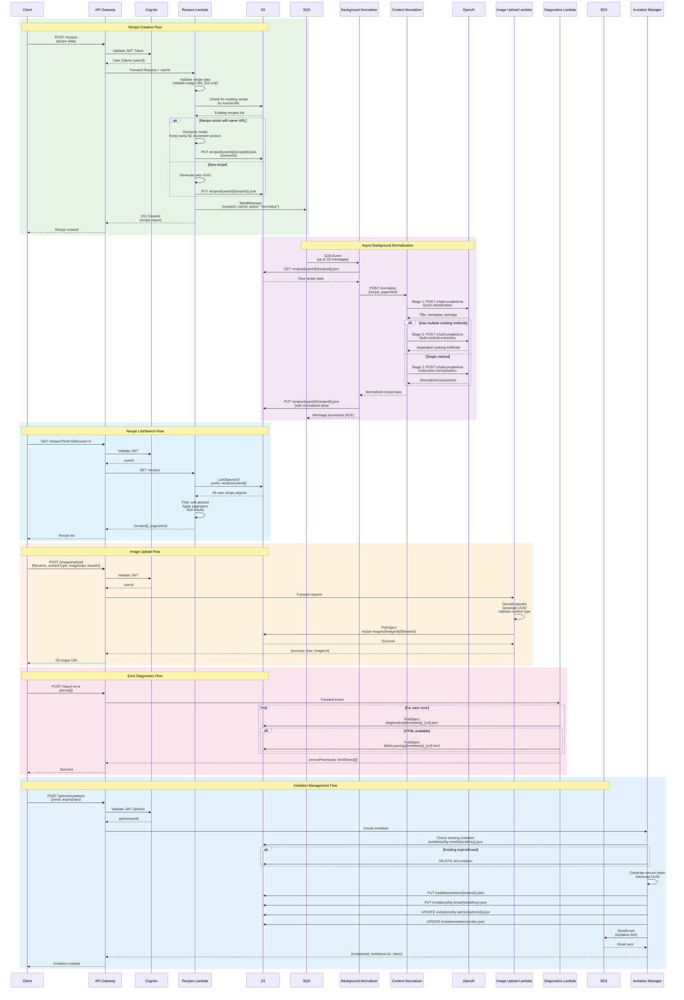

# RecipeArchive API Integration Diagram

This sequence diagram shows detailed API interactions between clients, Lambda functions, and external services for all major workflows.



## API Endpoints

### Recipe Management

#### `POST /recipes`
Create a new recipe with automatic normalization queuing.

**Request:**
```json
{
  "title": "Amazing Pasta Recipe",
  "ingredients": [{"text": "1 lb pasta"}, {"text": "2 cups sauce"}],
  "instructions": [{"stepNumber": 1, "text": "Boil water"}],
  "sourceURL": "https://example.com/recipe",
  "mainPhotoURL": "https://recipe-archive-dev.s3.amazonaws.com/recipe-images/..."
}
```

**Response (201):**
```json
{
  "recipe": {
    "id": "uuid-v4",
    "userId": "cognito-user-id",
    "title": "Amazing Pasta Recipe",
    "createdAt": "2025-09-30T12:00:00Z",
    "version": 1
  }
}
```

**Behavior:**
- Validates image URL (must be from S3 bucket)
- Checks for duplicate by sourceURL (overwrites if exists)
- Queues async normalization job to SQS
- Returns immediately with raw data

#### `GET /recipes`
List all recipes with pagination and sorting.

**Query Parameters:**
- `limit`: Results per page (default: 50, max: 100)
- `cursor`: Pagination cursor (integer index)
- `sortBy`: Sort field (createdAt, updatedAt, title)
- `sortOrder`: asc or desc

**Response (200):**
```json
{
  "recipes": [...],
  "pagination": {
    "nextCursor": "50",
    "hasMore": true,
    "total": 150
  }
}
```

#### `GET /recipes/search`
Search recipes with advanced filters.

**Query Parameters:**
- `q`: Text search query (OR logic with commas)
- `maxPrepTime`: Maximum prep time in minutes
- `maxCookTime`: Maximum cook time in minutes
- `semanticTags`: Comma-separated tags
- `primaryIngredients`: Comma-separated ingredients
- `cookingMethods`: Comma-separated methods
- `dietaryTags`: Comma-separated dietary restrictions
- `source`: Filter by source URL (OR logic)
- `timeCategory`: quick-15min, medium-30min, long-60min, extended-120min
- `complexity`: Simple, Moderate, Complex
- `mealType`: breakfast, lunch, dinner, snack, dessert

**Response (200):**
```json
{
  "recipes": [...],
  "pagination": {
    "nextCursor": null,
    "hasMore": false,
    "total": 23
  }
}
```

**Search Algorithm:**
- In-memory filtering (cost-optimized, no external search service)
- Text search across title, ingredients, instructions, tags
- Multi-term OR logic for comma-separated values
- Cumulative time category matching

#### `PUT /recipes/{recipeId}`
Update an existing recipe with partial updates.

**Request:**
```json
{
  "title": "Updated Title",
  "personalRating": 5,
  "cookingNotes": "Added notes"
}
```

**Response (200):**
```json
{
  "recipe": {
    "id": "recipe-id",
    "version": 2,
    "updatedAt": "2025-09-30T13:00:00Z"
  }
}
```

**Behavior:**
- Partial updates (null/undefined fields not modified)
- Increments version number
- Updates timestamp

#### `DELETE /recipes/{recipeId}`
Hard delete a recipe from storage.

**Response (200):**
```json
{
  "message": "Recipe permanently deleted from storage"
}
```

### Image Management

#### `POST /images/upload`
Upload recipe image directly to S3.

**Request:**
```json
{
  "filename": "recipe-photo.jpg",
  "contentType": "image/jpeg",
  "imageData": "base64-encoded-image-data..."
}
```

**Response (200):**
```json
{
  "success": true,
  "imageUrl": "https://recipe-archive-dev.s3.amazonaws.com/recipe-images/uuid/recipe-photo.jpg",
  "message": "Image uploaded successfully"
}
```

**Supported Formats:**
- JPEG (.jpg, .jpeg)
- PNG (.png)
- GIF (.gif)
- WebP (.webp)

### Normalization

#### `POST /normalize` (Internal)
OpenAI-powered content normalization (called by background-normalizer).

**Request:**
```json
{
  "originalRecipe": {
    "title": "bobs amazing pasta",
    "ingredients": [...],
    "instructions": [...]
  },
  "userId": "system",
  "sourceUrl": "https://example.com/recipe",
  "pageHtml": "<!DOCTYPE html>..."
}
```

**Response (200):**
```json
{
  "normalizedRecipe": {
    "title": "Bob's Amazing Pasta",
    "normalizedIngredients": [...],
    "normalizedInstructions": [...],
    "cookingMethods": []
  },
  "qualityScore": 8.5,
  "normalizationNotes": "Standardized title case, inferred servings",
  "inferredMetadata": {
    "cuisineType": "Italian",
    "cookingMethods": ["boiled"],
    "difficultyLevel": "Simple"
  },
  "fallbackUsed": false
}
```

**Normalization Features:**
- Two-stage processing (classification + detailed)
- Title case normalization (correct apostrophe handling)
- Multi-method recipe detection
- Servings and time inference
- Ingredient and instruction standardization
- Metadata enrichment

### Diagnostics

#### `POST /report-error`
Report parsing or runtime errors from clients.

**Request:**
```json
{
  "errors": [
    {
      "url": "https://example.com/recipe",
      "userAgent": "Chrome/120.0",
      "errorType": "PARSING_ERROR",
      "message": "Failed to extract recipe",
      "html": "<!DOCTYPE html>...",
      "timestamp": "2025-09-30T12:00:00Z"
    }
  ]
}
```

**Response (200):**
```json
{
  "message": "Diagnostic data received successfully",
  "errorsProcessed": 1,
  "htmlStored": ["diagnostics/2025-09-30_15-04-05_example.com_abc123.json"],
  "timestamp": "2025-09-30T12:00:00Z"
}
```

### Invitation Management

#### `POST /admin/invitations`
Create invitation for new user (admin only).

**Request:**
```json
{
  "email": "newuser@example.com",
  "message": "Welcome to RecipeArchive!",
  "expiryDays": 7
}
```

**Response (201):**
```json
{
  "invitationId": "uuid-v4",
  "invitationLink": "https://d1jcaphz4458q7.cloudfront.net/auth/register?token=hex-token",
  "token": "64-char-hex-token",
  "expiresAt": 1727788800
}
```

#### `GET /admin/invitations`
List all invitations created by admin.

**Response (200):**
```json
{
  "invitations": [
    {
      "id": "uuid",
      "email": "user@example.com",
      "status": "pending",
      "createdAt": 1727702400,
      "expiresAt": 1727788800
    }
  ],
  "count": 1
}
```

#### `DELETE /admin/invitations/{token}`
Revoke invitation (admin only).

**Response (200):**
```json
{
  "message": "Invitation deleted successfully"
}
```

### Health Check

#### `GET /health`
System health status.

**Response (200):**
```json
{
  "status": "healthy",
  "timestamp": "2025-09-30T12:00:00Z",
  "version": "1.0.0"
}
```

## Error Responses

All error responses follow this format:

```json
{
  "error": {
    "code": "ERROR_CODE",
    "message": "Human-readable error message",
    "timestamp": "2025-09-30T12:00:00Z"
  }
}
```

### Common Error Codes
- `UNAUTHORIZED`: Invalid or missing JWT token
- `VALIDATION_ERROR`: Request validation failed
- `NOT_FOUND`: Resource not found
- `METHOD_NOT_ALLOWED`: HTTP method not supported
- `INTERNAL_ERROR`: Server-side error
- `ACCESS_DENIED`: User lacks permission

## CORS Configuration

All endpoints support CORS with the following headers:

```
Access-Control-Allow-Origin: https://d1jcaphz4458q7.cloudfront.net (or *)
Access-Control-Allow-Methods: GET, POST, PUT, DELETE, OPTIONS
Access-Control-Allow-Headers: Content-Type, Authorization
Access-Control-Allow-Credentials: true
```

## Authentication

All endpoints (except `/health`) require JWT authentication via AWS Cognito:

```
Authorization: Bearer <jwt-token>
```

Token claims include:
- `sub`: User ID (Cognito user UUID)
- `email`: User email
- `exp`: Expiration timestamp