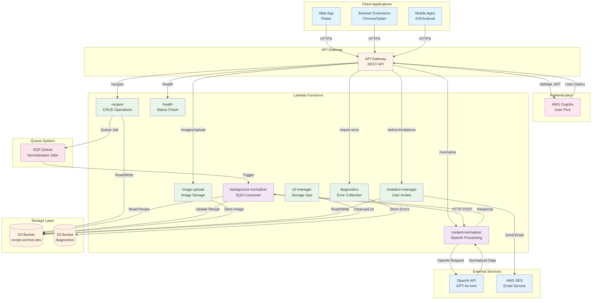

# RecipeArchive Data Flow Diagram

This diagram illustrates the complete data flow through the RecipeArchive AWS backend infrastructure, showing how client applications interact with Lambda functions, storage, and external services.

## Components Overview

### Client Applications
- **Web App**: Flutter web application served via CloudFront
- **Browser Extensions**: Chrome and Safari extensions for recipe capture
- **Mobile Apps**: iOS and Android Flutter applications

### API Gateway
- Single REST API endpoint
- JWT validation via Cognito authorizer
- CORS handling for all origins
- No /v1/ prefix on endpoints

### Lambda Functions (Go)

| Function | Path | Description |
|----------|------|-------------|
| recipes | `/recipes` | Full CRUD operations, search, pagination |
| image-upload | `/images/upload` | Direct S3 image uploads with validation |
| content-normalizer | `/normalize` | Two-stage OpenAI normalization |
| background-normalizer | SQS Trigger | Async recipe processing consumer |
| diagnostics | `/report-error` | Error telemetry collection |
| health | `/health` | System health check |
| invitation-manager | `/admin/invitations` | S3-based invitation system |
| s3-manager | CLI Tool | Storage cleanup and management |

### Storage Architecture
All data storage uses S3 (no DynamoDB in production):
- **recipes/{userId}/{recipeId}.json**: Recipe objects
- **recipe-images/{imageId}/{filename}**: Uploaded images
- **invitations/tokens/{tokenId}.json**: Invitation records
- **invitations/by-email/{emailKey}.json**: Email index
- **invitations/by-admin/{adminId}.json**: Admin index
- **diagnostics/{timestamp}_{url}.json**: Error diagnostics
- **failed-parsing/{timestamp}_{url}.html**: HTML context

### Security Features
- **Image URL Validation**: Only S3 bucket URLs allowed, external URLs rejected
- **Tenant Isolation**: Multi-level validation with user ID enforcement
- **JWT Authentication**: All endpoints require valid Cognito tokens
- **Resource Access Control**: Path-based access validation

### Performance Optimizations
- **In-Memory Search**: Cost-efficient Lambda-based filtering
- **Two-Stage Normalization**: Fast classification (10s) + detailed processing (25s)
- **SQS Batch Processing**: Up to 10 messages per invocation
- **Cursor Pagination**: Efficient navigation through large datasets

## Data Flow Patterns

### Synchronous Operations
1. Recipe CRUD operations
2. Image uploads
3. Invitation management
4. Health checks
5. Diagnostics submission

### Asynchronous Operations
1. Recipe normalization via SQS
2. OpenAI content enhancement
3. Email delivery via SES

### Storage Patterns
- **Write-Once, Read-Many**: Recipe objects
- **Overwrite on Duplicate**: Same sourceURL detection
- **Soft Delete**: IsDeleted flag, hard delete available
- **Versioning**: Increment version on update